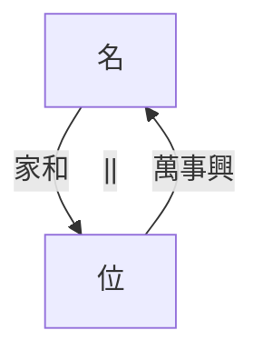

# 風天小畜（蓄）

比之序卦，風天小蓄。比指親和，親和之後就會結社。蓄，積也，聚象。

外風內乾，外順內健。內部有原則，外部柔順之象。要結社，內健，大家本身有一定嘅實力，有一定嘅看法且相同。同志之人必同聚。

## 卦爻

參考鏈接
[小畜卦 - 《易经》](https://yijing.5000yan.com/xiaoxugua/)

六爻 過
五爻 君
四爻 宰 陰位，最近君主之位
三爻 相
二爻 將
初爻 下

卦象，以小畜大。六四為陰位，其餘為陽。小畜之道，能以小畜大。柔順以對上下，溝通橋樑。天地之間，至剛之人或事，唯有巽順能止之。
風在天之上，天之上只能容風。作為中間人，調和各方矛盾，團結眾人。

處小畜之道，君子小則文章才藝，大則經世濟人之學，能抑眾剛。學習強健內在，有才方能服眾。
## 圖解

參考鏈接
[第9卦：小畜卦 - 《易经》](https://yijing.5000yan.com/64gua/423.html)

![[風天小畜.jpg]]

兩重山，險阻大也，出也。
一人山頂，獨行無依之象，向下坡走之象。
舟橫岸上，準備出發，但無水不行。
望竿在草裏，無訊息，故等待。
馬引羊渡河，馬為貴人，肖馬，馬姓之人。時機，午，或午年，或午月，或午日，或午時
重病卜到風天小畜，望竿頭，望，旦夕而亡，午時或午日走。羊，陽也，羊跑掉，無回頭。根據面相判斷是何人重病。若面相無指示，必壞，親人重病，氣色看不出來，無憂氣，盼望其早逝，或趁早爭家產。

草，草頭黃。

> [!quote] 倪海廈
> 黃為中國大姓。中國係李氏皇朝。 姓李嘅都容易入朝，因為比較親和。李氏出現時大多有皇朝之亂。
> 講太多，沒有甚麼怪聲音。我在講很多的時候就發現有怪聲音出現，就叫我不要講。今天沒有。

> [!quote] 倪海廈
> 黃曆上面日有天干地支，斗數教完以後，六十四卦講完以後，我會教諸位如何用易經八卦來排命。你今年流年是風天小畜，你今年流年是地水師……用卦來排命要用到四柱名卦，年的干支，月的干支，日的干支，時的干支，教諸位怎麼查。你黃曆打開來看上面就有日子的干支了嘛。

> [!quote] 倪海廈
> 如果我們沒有這些本領，我們光是在主觀認知中就會過於主觀。我們為什麼在學我們老祖宗那麼多五千年的經驗？就是不要讓傷害很大的事情在你認為不可能之下發生。協助諸位在一輩子，在那一剎中間能夠認定一個人，幫助你作決策你就不會錯了。因為一念之差，可能舉棋皆輸。

## 陽宅

長女居西北，長女居父位
長女認為自己係父親，形係長女，神係父，行為似父。主觀很強，個性很強，家裏一言獨尊，外出賺錢養家，給過多責任到自身。婚姻不成，思想老成，覺得同齡男性幼稚。事業上有積蓄但小氣，因為小蓄。職位為於眾剛之間。到老出家。
未 已，未婚等於已婚，所以婚姻不成
女 男，女人等於男人，女人看起來似男人，禿頭，所以到老出家。
三女住西北，長女次女已出嫁，三女為長女，成格。

名位相等

當你是甚麼名，住甚麼位時，這個過程，稱之為家和。
當你住甚麼位，要用甚麼名，叫萬事興。

世代交替
要事業興，要位等於名，你住誰的位置要用誰的名。舉例，你名叫父，住長子之位，天雷無妄，在用你名字做老闆時，招徠無妄之災。你名叫父，住次子之位，天水訟，在用你名字做工商就會訟，招惹官非。居長子之位，公司用長子名義來做，長子是董事長，你是總經理，運作正常。
夫妻本來居西北，年齡大後，事業要傳給兒子。但兒子未婚，居東宮。當兒子名位相等時，才可以讓兒子做公司負責人。兒子已婚，父母退位住三子位，長子繼位住西北位。
北半球全部是這樣，南半球時東西不動，南北對調。北半球春對應南半球秋，北半球夏對應南半球冬。

> [!note] 個人認為
> 此處重點，南半球陽宅，東西不動，南北對調

如果有日我不願意同妻子同居乾為天，不想妻子地天泰，我要住在南位，我是天火同人，妻子是地火明夷。我想要害死我妻子，妻子受到暗傷。但係想要事業不敗，要掛次女之名做事業。

> [!bug] 訂正
> 倪海廈老師此處說風火家人為口誤，實則應為天火同人。

更深入一層，臨牀經驗告訴我們，一入去那個宅，看到有那個宮在裏面，且很大，就代表這一家中發那一房。那一房的腦筋最清楚，就發那一房。那一房中，南宮最大，那次女最強。又如，一家中，未來公婆主臥在西南角，你不必理會公公，婆婆才是決定的人。
陰宅風水亦然。